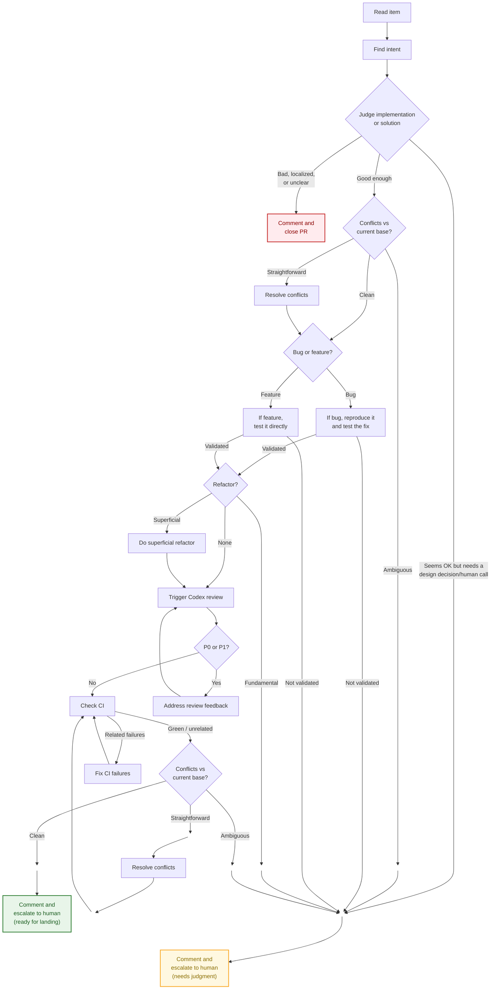

This flow requires an explicit `--approve-all` grant when run through
`acpx flow run`.



This prompt may process multiple items in one run. Use it for the triage lane, not the single-PR landing lane.

1. **Process each item independently.** Take a list of items as input. Each item may be a PR, an issue, or a raw issue description. Process each item separately and do not let the framing of one item leak into another.

2. **Figure out what the work is trying to do for a human.** For each item, first figure out the real intention behind it. Read the code, the diff, the issue text, the PR description, and any surrounding context needed to answer one question in plain language: what is this actually trying to do for a human? Write that intention like one human talking to another human. Do not hide behind technical jargon. Translate jargon into purpose. If the stated PR description sounds model-generated or overly technical, do not repeat it blindly; recover the plain-language goal underneath it.

3. **Decide whether the implementation or solution actually solves the real problem.** Once you have the intention, judge the work against that intention. Do not stop at “does the code compile” or “does the diff match the ticket.” Ask whether the PR or proposed implementation is addressing the underlying problem in a real and durable way, or whether it is only treating a symptom locally. Be explicit about the difference between a fundamental fix and a shortcut, band-aid, or narrowly scoped patch that avoids the real issue.
   - Treat an unclear PR the same as a bad or localized fix for closure purposes. If the PR is not even clear enough to evaluate confidently, it should be closed rather than routed to a human.

4. **Close PRs that are wrong, too local, or too unclear.** If the item is a PR and your judgment is that the proposed solution is wrong-shaped for the problem, only treats a symptom, is just a localized fix that does not address the underlying issue, or the PR is not even clear enough to evaluate confidently, do not send it down the human-review lane by default. Instead, treat that as a rejection outcome for the PR: write a concise comment explaining the plain-language intention as best you can recover it, why the current implementation does not solve the right problem or is too unclear to keep moving, and what kind of reframing would be needed, then close the PR. Use the human-attention lane for cases that need a human product or architecture judgment before deciding whether the work should continue at all.

5. **Classify how much refactoring is really needed.** As part of that judgment, explicitly decide whether the item needs a refactor, and if so what kind:
   - no refactor needed: the current shape is acceptable for the intention
   - superficial refactor: cleanup, reshaping, or local improvement is needed, but the work can still be completed autonomously without changing the core framing of the solution
   - fundamental refactor: the current approach is wrong-shaped for the problem and needs a deeper restructuring, reframing, or architectural change in order to solve the intention properly

6. **Choose between continue, close, or escalate.** Based on that judgment, decide whether the item is safe to keep moving autonomously, should be closed, or needs human attention before landing. Close a PR if any of the following are true:
   - the intention is unclear, conflicting, or poorly framed
   - the implementation is not actually serving the intention
   - the solution is too localized, too reactive, or too narrow for the problem it claims to solve
   - the PR is a shortcut, band-aid, or symptom fix rather than a real solution
   - the current implementation should be rejected rather than iterated on

7. **Only escalate when a real human judgment call is needed.** Route the item to a human if any of the following are true:
   - the right answer may require reframing the problem, changing the product behavior, or making an architectural call rather than just fixing code
   - a fundamental refactor is needed to solve the problem properly
   - a human must decide what the correct product or architecture direction should be before any implementation can be judged

8. **Check conflicts against the current base before doing write-heavy autonomous work.** After the early read-only judgment says the solution is good enough to continue, update against the current base in the isolated workspace and check whether the branch still applies cleanly. If there are no conflicts, continue. If the conflict has a clear resolution path, resolve it autonomously and then continue. If the conflict still needs human judgment about the right final shape, stop and escalate to a human instead of pretending the rest of the autonomous lane is still trustworthy.

9. **Choose the right validation path before polishing the PR.** After deciding that the solution is good enough to continue, explicitly decide whether the PR is primarily a bug-fix or a feature/behavior change. That choice determines how the work should be validated before it proceeds to refactor, review, or CI.

10. **If it is a bug, reproduce it and then test the fix.** For a bug-fix, regression, or other failure claim, identify the smallest targeted repro or test that captures the issue. If needed, temporarily ablate the fix or the changed test setup so you can demonstrate failure on the refreshed base or ablated state. That temporary ablation must stay local only: do not commit it, do not push it, and do not leave the PR branch in the broken state. Restore the real PR fix in the working tree before continuing, then rerun the same repro or targeted test to prove that the fix changes the outcome. When feasible, also run relevant integration or end-to-end tests near that behavior.

11. **If it is a feature, test the changed behavior directly.** For a feature or behavior change, validate the changed behavior directly on the PR branch with the smallest targeted test or check that shows the feature works as intended. When feasible, also run relevant integration or end-to-end tests near that behavior. Do not force an artificial “reproduce a prior failure” step for work that is not actually a bug fix.

12. **Escalate if the claimed work cannot actually be validated.** If a bug cannot be reproduced, the fix does not change the outcome, or a feature change cannot be validated confidently with targeted testing, stop and escalate to a human rather than continuing into refactor, review, or CI as if the work were proven.

13. **Do superficial refactors before continuing into review.** If the item only needs a superficial refactor, that does not require human attention by itself. Superficial refactors should be done on the autonomous lane before the item proceeds into Codex review. Only fundamental refactors trigger the human-attention path.

14. **Keep moving when the work is good enough to continue.** If the item does not need human attention and is not a close outcome, continue autonomously. It is acceptable to proceed with automated conflict resolution, review, local validation, CI/CD checking, and follow-up fixes as long as the intention is clear, the work has been validated on the correct bug or feature path, and the item does not require a human product or architecture judgment. If the implementation looks acceptable enough to continue, keep going rather than blocking on perfectionism.

15. **Do not spend review effort on work that should stop early.** Only continue into Codex review if the item is safe to continue autonomously. If the item needs human attention or should be closed, stop the autonomous flow there. Do not spend time running Codex review, fixing code, or chasing CI on work that is not ready to merge anyway. Instead, write up the intention, the reason human attention is required or the reason the PR should be closed, whether a fundamental refactor is needed, whether the bug or feature claim could actually be validated, and the exact decision or reframing needed from a human.

16. **Trigger Codex review in a fixed order on every PR that stays on the autonomous lane.** For items that are safe to continue autonomously, every PR must go through Codex review in this order. First, check whether the PR already has Codex review comments on GitHub for the current PR head and address the valid unresolved ones. Do not skip existing Codex feedback just because you plan to run another review. When reading GitHub review state, do not rely on `gh pr view --comments`; use stable REST-backed `gh api` calls such as `repos/{owner}/{repo}/pulls/{pr}/reviews`, `repos/{owner}/{repo}/pulls/{pr}/comments`, and `repos/{owner}/{repo}/issues/{pr}/comments` instead. After that, refresh the PR base branch from origin, determine the correct updated base ref or merge base from the checked-out repo, and run a fresh local `codex review --base <base>` against that fresh base ref. Do not review against a stale local base branch, against the whole repository state, or against a stale local diff. A local `codex review` may legitimately take up to 30 minutes in this flow; do not treat it as stuck before that budget is exhausted unless a stronger signal shows it is actually wedged. If that local Codex review cannot be completed reliably, including timing out, stop pretending review is clear and escalate to a human. Treat P0 and P1 findings from either source as blockers that must be resolved before the PR can move forward. P2 and lower findings are not blockers by default; handle them with judgment and do not keep looping just to polish them unless they materially change the intention-first assessment.

17. **Address blocking review feedback and rerun local review if needed.** After Codex review, make sure the review feedback is actually closed out. That means:

- valid Codex findings from GitHub reviews are fixed or otherwise resolved with a clear reason
- the PR base branch has been refreshed from origin before local review
- a fresh local `codex review --base <base>` has been run against the current branch state relative to that fresh base ref
- if you changed code while addressing review feedback, rerun the targeted validation from the earlier bug-or-feature validation step and any nearby integration or end-to-end tests when feasible before continuing
- irrelevant findings are explicitly dismissed or explained, not silently ignored
- stale comments from older commits are recognized as stale and not mistaken for current blockers
- if P0 or P1 findings remain, address that review feedback and run local review again until the blocking findings are cleared

18. **Check whether CI failures really belong to this PR, and approve workflow runs when that is the blocker.** Then evaluate CI/CD for items still on the autonomous lane. If CI is green, that part is satisfied. If CI is not fully green, determine whether the failures are actually caused by the PR. If a workflow run is blocked only because it needs maintainer approval to run, the agent should approve or enable that workflow run immediately if it has permission, for example with the workflow-run approval endpoint `POST /repos/{owner}/{repo}/actions/runs/{run_id}/approve`, and then re-check CI before escalating. This is not a separate human decision when the agent can do it itself. If failures are unrelated, pre-existing, or clearly due to external churn outside the diff, document that plainly and do not treat them as blockers. If the failures are plausibly related to the PR, they must be fixed before landing. After fixing related CI failures or approving the blocked workflow run, check CI again until the related failures are gone or clearly shown to be unrelated. If the only remaining blocker is a workflow approval gate that the agent actually tried and failed to clear, escalate to a human and say that explicitly.

- if you changed code while fixing CI-related problems, rerun the targeted validation from the earlier bug-or-feature validation step and any nearby integration or end-to-end tests when feasible before checking CI again

19. **Check for new conflicts again before the final handoff or landing decision.** After review is clear and CI is green or clearly unrelated, check one more time whether the branch still applies cleanly to the current base. The base branch may have moved while review or CI was in progress. If new conflicts appeared, assess them again. If they have a clear resolution path, resolve them autonomously, then go back through the final CI check path on the updated branch. If they still need human judgment about the right final shape, escalate to a human instead of pretending the PR is still merge-ready.

20. **Only land PRs that clear every gate.** A PR is ready to land only if all of the following are true:

- the plain-language intention is clear
- the implementation serves that intention in a real way rather than merely covering symptoms
- the branch either applies cleanly to the current base or only needed conflicts with a clear resolution path that were resolved and then revalidated
- the work has been validated on the correct path: a bug was reproduced and shown fixed, or a feature was tested directly
- any needed refactor is either unnecessary or superficial rather than fundamental
- there is no remaining need for human framing or architectural judgment
- Codex review has happened, existing GitHub Codex feedback has been handled, and there are no unresolved P0 or P1 findings
- CI/CD is green, or any remaining failures are clearly unrelated to the PR

21. **Apply the same judgment to issues, but only close real PRs.** If the item is an issue or issue description rather than an existing PR, do the same intention-first analysis and decide whether it is ready for autonomous implementation or whether it needs human framing first. If the issue is already framed well enough to proceed, say so. If it is not, explain exactly what judgment call, fundamental refactor, or reframing a human still needs to provide. The explicit close action applies only to real PRs.

22. **Write down one concise decision record for each item.** For every item, produce a concise but complete result with these sections:

- Plain-language intention
- Is the intention valid
- Does the current PR or proposed solution actually solve the right problem
- Conflict status: clean, clear resolution path resolved, or needs human judgment escalated
- Was the work validated on the correct path: bug reproduced and fixed, or feature tested directly
- Should this PR be closed immediately
- Refactor needed: none, superficial, or fundamental
- Human attention required, safe to continue autonomously, or close now
- Codex review status and any blocking findings
- CI/CD status and whether any failures are unrelated
- Final recommendation: close PR, land, continue autonomously, or escalate to a human

23. **Post the result back, and close PRs when the outcome says to close them.** If the item is a real PR or issue, post the final result back onto that item as a comment. The comment should be written for a human reviewer or author, in plain language, and should include the intention, the judgment about whether the work really solves the right problem, whether conflict resolution had a clear resolution path or still needed human judgment, whether the work was actually validated on the correct bug or feature path, whether a refactor is needed and what kind, whether the PR should be closed, any blocking Codex review or CI concerns, and the final recommendation. There are two human-escalation variants: one for `needs judgment`, where the autonomous review-and-land path stopped early because a fundamental refactor, a conflict that still needs human judgment, a failed validation step, or human reframing is still needed; and one for `ready for landing`, where the autonomous lane is otherwise clear and the remaining step is a human landing decision. If the item is a PR and the conclusion is that the current implementation is unclear, a bad fix, or merely a localized fix, close the PR after posting the comment. If the input item is only a raw issue description with no real item to comment on, skip the posting step and state that there was no concrete item to comment on.

### Timeout assumptions in the executable flow

These are the current operational timeout assumptions in the single-file executable workflow, and the markdown should stay in sync with the TypeScript file:

- `prepare_workspace`: 20 minutes
- `check_initial_conflicts`: 20 minutes
- `resolve_initial_conflicts`: 30 minutes
- `reproduce_bug_and_test_fix`: 30 minutes
- `test_feature_directly`: 25 minutes
- `do_superficial_refactor`: 25 minutes
- `collect_review_state`: 60 minutes
- nested local `codex review` inside `collect_review_state`: 30 minutes
  Do not treat that nested review as stuck before the 30 minute budget is
  exhausted unless you have stronger evidence than elapsed time alone.
- `review_loop`: 90 minutes
- `collect_ci_state`: 15 minutes
- `fix_ci_failures`: 60 minutes
- `check_final_conflicts`: 20 minutes
- `resolve_final_conflicts`: 30 minutes
- `post_close_pr`: 15 minutes
- `post_escalation_comment`: 10 minutes
- `ensureProjectDependencies` (`pnpm install --frozen-lockfile` when needed): 20 minutes
- each targeted validation command in the bug/feature validation steps: 20 minutes

ACP steps without an explicit timeout in the workflow currently rely on the `acpx` flow runtime default. At the moment that default is 15 minutes, so if a step such as `extract_intent`, `judge_solution`, `bug_or_feature`, `judge_refactor`, `comment_and_close_pr`, or `comment_and_escalate_to_human` should have a different budget, that must be stated explicitly in the workflow file.

24. **Use a short, scannable comment template with explicit status signals.** Use an actual comment template when posting the result. Keep it short, plain, and scannable. Use helpful status emojis so a human can quickly tell whether this is safe to keep moving, needs intervention, or should be closed. When the outcome is `escalate to human`, use one of two human note variants: `needs judgment` or `ready for landing`. Both should keep the same basic layout, but the human-decision line and recommendation should make the variant obvious. This template is mandatory for posted comments. Do not invent a different layout.

ACP judgment steps in the executable workflow are JSON-only by contract. They should return a single JSON object with no commentary, preamble, or markdown fences. The flow runtime still uses compatibility JSON extraction as a safety net when the model adds recoverable extra text, but the prompt contract is still exact JSON only.

Emoji guide:

- `✅` valid / good / safe
- `⚠️` needs human attention
- `🛑` close the PR
- `🔧` superficial refactor
- `🧱` fundamental refactor
- `🟢` safe to continue autonomously
- `🔴` blocked from autonomous landing
- `➖` not applicable
- `🧭` validation status
- `🧪` Codex review or test status
- `🚦` CI/CD status
- `🏁` final recommendation

Default comment template:

```md
## Triage result

### Quick read

- Intent valid: ✅ Yes / ❌ No
- Solves the right problem: ✅ Yes / ⚠️ Partly / ❌ No / 🛑 Localized, bad, or unclear fix
- Validation: ✅ Bug reproduced and fixed / ✅ Feature tested directly / ⚠️ Not validated / ➖ Not applicable / ⏸️ Not run
- Close PR: 🛑 Yes / ✅ No
- Refactor needed: ✅ None / 🔧 Superficial / 🧱 Fundamental
- Human attention: ⚠️ Required / 🟢 Not required / 🛑 Not applicable because PR should close
- Recommendation: 🏁 <close PR / land / continue autonomously / escalate to a human>

### Intent

> <plain-language intention>

### Why

<2-5 plain-language bullets explaining the judgment>

### Codex review

- Status: 🧪 Not run / 🧪 Already present / ✅ Clear / 🔴 Blocking findings remain
- Notes: <short review summary>

### CI/CD

- Status: 🚦 Green / 🚦 Mixed but unrelated / 🔴 Related failures remain / ⏸️ Approval needed / ⏸️ Not checked
- Notes: <short CI summary>

### Recommendation

🏁 <close PR / land / continue autonomously / escalate to a human>
```

If the item needs human attention because the autonomous lane stopped early, the template should make that obvious near the top:

- `Human attention: ⚠️ Required`
- `Human decision needed: <design decision/human call | conflict still needs human judgment | validation not established | ready for human landing decision | other explicit reason>`
- `Refactor needed: 🧱 Fundamental` if applicable
- `Recommendation: 🏁 escalate to a human`

If the item is otherwise clear and only needs a final human landing decision, the template should make that obvious near the top:

- `Human attention: ⚠️ Required`
- `Human decision needed: ready for human landing decision`
- `Recommendation: 🏁 escalate to a human`

Keep the same basic human note shape for both variants. Change the human-decision line, the supporting explanation, and the recommendation wording only as needed to make the variant obvious.

If the item is a PR and the solution is bad, unclear, or merely localized, the template should make that obvious near the top:

- `Solves the right problem: 🛑 Localized, bad, or unclear fix`
- `Close PR: 🛑 Yes`
- `Recommendation: 🏁 close PR`

If the item is safe to keep moving:

- `Human attention: 🟢 Not required`
- `Recommendation: 🏁 continue autonomously` or `🏁 land`

25. **Be rigorous about protecting the project from wrong-shaped work.** Be extremely diligent. The point of this prompt is not just to do process. The point is to protect against technically polished PRs that sound right but are solving the wrong thing, solving too little, or avoiding the real problem behind the work.
